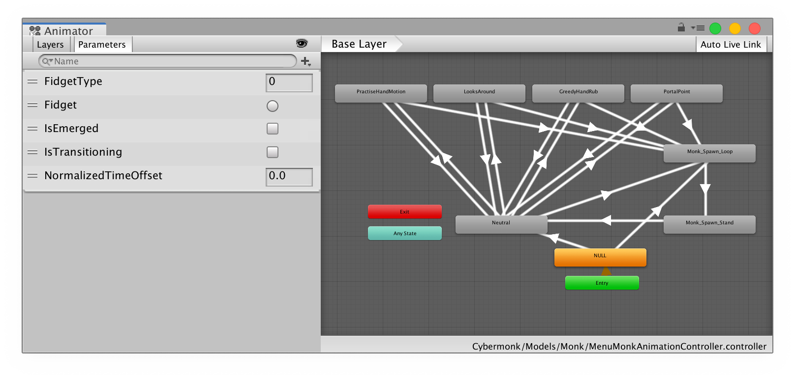

# destringer

Code generation tool to create type safe wrapper for Unity3D's Animator API.

## Background

Unity3D uses a string-based API to control its animation state machines. As a
result developers do not get compile-time checks on their parameter names, or
auto-complete in their code editor.

I found that I was often writing a lot of boilerplate to wrap `Animator`
methods (e.g. `GetFloat`, `SetFloat` etc.) in C# properties.

I made this tool that automates this process, generating a script that
perfectly matches

Creates a C# interface for your `RuntimeAnimationController` state machines, and keeps it up to date.

## Install

Available as a Unity3D [package](https://docs.unity3d.com/Manual/CustomPackages.html).

Add the following entry to your `<Project>/Packages/manifest.json`:

```json
{
  "dependencies": {
    "games.feed.destringer": "https://github.com/rhys-vdw/unity-destringer.git",
  }
}
```

Unity will download the package automatically.

## Usage

### Assets > Destringer > AnimatorWrapper

Create an AnimatorWrapper object that can be configured to generate a script. Once given a `RuntimeAnimationController` hit the "Generate" button. This object will automatically update the script whenever its assigned controller changes.

### Tools > Destringer > Attach animator wrappers

This will attach generated scripts to any selected GameObject's with animators, creating and updating as necessary.

## Example

Given the following animator:



destringer will generate a C# script with the following properties:

```cs
public int FidgetType
{
    get => _animator.GetInteger(FidgetTypeProperty);
    set { _animator.SetInteger(FidgetTypeProperty, value); }
}

public void Fidget()
{
    _animator.SetTrigger(FidgetProperty);
}

public bool IsEmerged
{
    get => _animator.GetBool(IsEmergedProperty);
    set { _animator.SetBool(IsEmergedProperty, value); }
}

public bool IsTransitioning
{
    get => _animator.GetBool(IsTransitioningProperty);
    set { _animator.SetBool(IsTransitioningProperty, value); }
}

public float NormalizedTimeOffset
{
    get => _animator.GetFloat(NormalizedTimeOffsetProperty);
    set { _animator.SetFloat(NormalizedTimeOffsetProperty, value); }
}
```